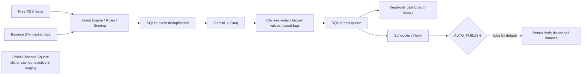

# Binance Square AI — Phase 1.6

**English** | [简体中文](README.zh-CN.md)

A self-hosted Binance Square AI drafting system, incrementally adapted from
[MIT-licensed buffer-poster-bot](https://github.com/SMOService/buffer-poster-bot).
The sole code baseline is upstream commit `acc720e9aae7748a029400202626eab26dc8c005`.
No other legacy projects were integrated. The original MIT license and SMOService copyright notice remain intact; see [LICENSE](LICENSE).

**Drafts only by default: `AUTO_PUBLISH=false`. Docker Compose also forces this setting to false.**
Phase 1 has not been deployed to production or tested with real provider credentials or real Binance Square posts.
The documentation is bilingual; the AI writer and review dashboard currently produce Chinese content.

## Phase 1.6 VPS staging preparation

Follow the [staging guide](docs/STAGING.en.md) ([Chinese](docs/STAGING.md)) for checkout, secrets,
authenticated startup, real probes, draft review, logs, updates and consistent SQLite backup.
Staging uses real models/public data to prepare drafts; Square credentials are ignored/not required.
All CLI/backend entry points force dry run, Compose forces false and the backend scheduler remains locked.
Runtime environment changes also cannot make health/dashboard display publishing as enabled.

```bash
python -m src.cli readiness
python -m src.cli quality-report
python -m src.cli session-report
# All three support --json and never make network requests.
```

Readiness requires a healthy DB, dry-run lock, at least one configured provider, ADMIN_TOKEN,
and successful nonempty latest Binance Spot data within READINESS_MAX_AGE_SEC (default 3600).
Spot is critical: unknown/failed/stale observations give ready=false (exit 1); RSS is noncritical,
so CoinDesk failure alone does not block drafting. Configuration is not credential verification: run test-ai.
Network diagnostics distinguish DNS, connect/read timeouts, TLS, HTTP status and total timeout without raw errors.

Quality reports cover all unpublished drafts, showing pending/good/bad, good/(good+bad), top 10 normalized bad notes,
and good/bad grouped by event_type/source/symbol/ai_provider. Unrated good_rate is null/N/A.
Session reports use a rolling 24-hour UTC window and persist collection outcomes and per-model HTTP attempts,
including retry, fallback and test-ai. AI-generated drafts show current ratings; manual drafts are excluded.
SQLite v7 -> v8 adds telemetry without replacing queue/ratings/budgets. Historical counters cannot be reconstructed;
the first 24 hours explicitly show partial coverage. CLI checks retain active writer claims; startup recovery remains.
Back up before upgrading. RUN_LIVE_TESTS stays false in default CI and no real keys are injected.

Phase 1.6 validation: **90 tests passed, 7 live cases skipped**, Ruff and compileall passed locally.
The [verified Phase 1.6 CI run](https://github.com/xingxinghuisi/binance-square-ai/actions/runs/37665111835)
at commit `472ff5f` also passed Compose build/up/health and staging readiness/quality/session smoke.
Local Docker is unavailable; these actual container checks ran in GitHub Actions. No VPS was deployed,
and this phase did not run real AI/source probes or publish to Square. See [validation](docs/VALIDATION.md).

## Phase 1.5 diagnostics and review

Phase 1.5 adds real-request diagnostics and draft quality records without redesigning Phase 1.
The backend and **all CLI commands force `AUTO_PUBLISH=false`**. The backend scheduler is also
locked to dry run, even if the environment changes. Compose continues to force false.
The retained publishing library is not reachable through these commands or API routes.
Collector/AI HTTP is limited to public data and model endpoints; feed redirects stay on the
same HTTPS host, and model credentials are never forwarded through redirects.

```bash
python -m src.cli test-ai
python -m src.cli test-sources
python -m src.cli collect-once
python -m src.cli preview --limit 10
python -m src.cli rate-draft 123 good
python -m src.cli rate-draft 124 bad --note "开头太模板化"
```

`test-ai` independently sends a tiny JSON smoke request to each configured provider, without
fallback, posts or queue insertion. It consumes the shared daily request budget, including retries.
Exit codes: 0 = all configured providers passed; 1 = a configured provider failed; 2 = no keys configured.
`test-sources` reads RSS/Spot only and persists source counts, elapsed milliseconds and sanitized errors.
It returns 1 if any source failed. `collect-once` prints RSS counts per source, market status per pair,
received/accepted/deduplicated/rejected events, actual Gemini/Groq HTTP attempt counts and drafts.
Its request counts are per invocation, not the daily total; a source/writer error returns 1 while
successful sources and accepted events remain saved. An unconfigured AI is explicitly skipped.

`GET /api/status/providers` returns Gemini/Groq configured/model/reachable/last_success/last_error.
`GET /api/status/sources` returns each source's status/latency_ms/last_success/last_error/items.
These authenticated read-only endpoints **never trigger probes**. Records survive restarts;
unprobed providers have `reachable=null`, sources have `status=unknown`, and changing a key/model
invalidates previous provider observations. Reachability is the last observed attempt, not a
continuous guarantee; a shared-budget rejection is reported explicitly. Sources use `ok`, `empty`,
`error`, or `unknown`. Last successful timestamps remain available after subsequent failures.
No API keys, request bodies, raw model output or signed URLs are returned in diagnostics.

Queue cards, `/api/queue` and CLI preview include Event Type, Symbol, Score, Source, AI Provider,
Generated At and full text. New AI drafts persist the provider and generation time; legacy/manual
drafts may have unknown metadata. Preview excludes published posts and performs no network calls.
Generated At is a Unix UTC timestamp in the API/dashboard and ISO UTC in CLI preview.

Quality fields are `quality_status` (`pending`, `good`, `bad`) and `quality_note` (max 2000 characters).
Use `POST /api/drafts/123/quality` with JSON:
`{"quality_status":"bad","quality_note":"开头太模板化"}`. Existing admin authentication applies;
non-JSON/cross-origin mutations are rejected. This only records human feedback and never publishes
or automatically edits a prompt. SQLite v6 -> v7 is additive; back up the database before upgrading.

Real smoke tests require explicit opt-in:

```bash
# Linux/macOS; may consume model credits if keys are configured
RUN_LIVE_TESTS=true AUTO_PUBLISH=false python -m pytest tests/integration -q
# Windows PowerShell
$env:RUN_LIVE_TESTS="true"
$env:AUTO_PUBLISH="false"
python -m pytest tests/integration -q
```

Keep `RUN_LIVE_TESTS=false` for ordinary runs. CI forces false and supplies no real keys; mock tests
also block external HTTP. The seven live cases cover Gemini, Groq, Binance Spot and the four RSS
sources. Missing model keys skip only those model cases; configured failures fail with sanitized
provider/source errors. No live case imports or calls a Square publisher.

Current local results: **70 passed, 7 live tests skipped**, Ruff and compileall passed.
Real source probes parsed Cointelegraph 30, Decrypt 30, The Block 19; CoinDesk and Binance Spot
timed out on this network. Real AI smoke was skipped because no keys are configured here.
Phase 1.5 remote CI at commit `d5e9bf2` **passed pytest, Ruff, compileall, independent import and
Compose build/up/health** ([verified run](https://github.com/xingxinghuisi/binance-square-ai/actions/runs/37593756735)).
Local Docker commands could not run because Docker is absent; the actual container checks ran
in GitHub Actions. These are not production deployments.

## Audit and retained capabilities

The project retains SQLite, the post queue, scheduling, exponential backoff, deduplication,
publication history, Docker, and the original official Binance Square publishing client.
The default entry point and container no longer depend on Telegram, Buffer, imgbb, catbox, or 0x0.st.
Legacy source files are temporarily retained, but `bot.py` is disabled and aiogram is absent from runtime dependencies.

See the [Phase 1 audit and change inventory](docs/PHASE1_AUDIT.md) for the original file responsibilities,
retention/removal decisions, and fixes. [UPSTREAM](docs/UPSTREAM.md) records provenance and official API references.
The original English upstream README is preserved at `docs/UPSTREAM_README.md`; it is historical documentation, not the current setup guide.
The audit and detailed validation report are currently written in Chinese.

## Architecture

```text
src/
  collectors/
    binance_market/        Binance Spot exchangeInfo and 24hr ticker
    crypto_news/           CoinDesk, Cointelegraph, Decrypt, The Block RSS
    binance_futures/        Extension boundary; not implemented in Phase 1
    binance_announcement/   Extension boundary; not implemented in Phase 1
  engine/
    event_engine.py         Unified events, filtering and persistence
    scoring.py              Deterministic initial scoring
    deduplicator.py         Cross-source headlines and hourly market snapshots
    rules.py                Score, age and future-timestamp checks
  ai/
    provider.py             AIProvider protocol; Gemini -> Groq fallback
    gemini.py / groq.py      REST adapters with environment-supplied keys
    classifier.py           Deterministic classification; no extra AI requests
    writer.py               Chinese prose, length/opening checks, verified facts
  publisher/
    binance_square/         Adapter for services/binance.py and local images
    retry.py                Exponential backoff and UTC quota reset
  storage.py                Events, atomic enqueue/dedup, opening history, AI budget
  pipeline.py               Collect -> events -> writer -> SQLite draft queue
  scheduler.py              Independent scheduler with dry-run gates
  diagnostics.py            Durable provider/source observations, guarded HTTP
  app.py                    Read-only dashboard, APIs, health and background workers
  cli.py                    Local text/image draft enqueue and one-shot collection
  http.py / settings.py     Shared timeout/retry policy and configuration
db.py                       Existing database, incrementally migrated to schema v8
services/binance.py          Preserved official v1/v2 publishing flow
prompts/writer.txt           Editable writing prompt
```



News collectors return `{id, source, title, summary, url, published_at, symbols}`.
HTML is stripped, tracking parameters are removed, and timestamps are normalized to UTC.
Items without reliable publication dates are skipped instead of being assigned the current time.
One unavailable feed does not stop the remaining feeds; failures are recorded in collection history.

Market snapshots contain `symbol, base_asset, quote_asset, last_price, change_24h, volume_24h,
quote_volume_24h, high_24h, low_24h, timestamp, source`.
Numeric values remain decimal strings. `change_24h` is a percentage; `volume_24h` is base-asset volume,
and `quote_volume_24h` is quote-asset volume. Asset tags use Binance exchangeInfo's `baseAsset`, such as `$BTC`, rather than `$BTCUSDT`.

Events use `{type, symbol, score, timestamp, data, source}`.
Initial scoring is an explainable heuristic with a configurable threshold: news receives points for summaries and recognized assets;
market events receive points for absolute 24h price changes. It is not a prediction model.
Headlines are normalized for cross-source deduplication; market snapshots are limited to one event per asset per UTC hour.
The original MD5 text deduplication remains in place.

## Run locally

Use Python 3.12+ and run these commands from the project root:

```bash
python -m venv .venv
# Linux / macOS
source .venv/bin/activate
# Windows PowerShell
# .venv\Scripts\Activate.ps1
pip install -r requirements.txt
cp .env.example .env
python -m src.app
```

On Windows, use `Copy-Item .env.example .env` instead of `cp` if preferred.
The app loads `.env` from the project root; existing environment variables take precedence.
It can start, collect data, and show events without any API keys. AI drafts require at least one configured model provider.
Gemini is the primary provider; Groq is optional fallback. Model IDs are configurable.
**Provider availability and free allowances depend on your account. The project does not assume a guaranteed monthly $10 credit.**

Open the dashboard at <http://127.0.0.1:8080/>.
Collection runs every 15 minutes by default, and the scheduler checks the queue every 60 seconds.
The dashboard is read-only: it shows complete drafts, event scores/states, and preparation/publication history. It has no publish button.
Set `COLLECT_ENABLED=false` to disable collection during a local review.

## Docker Compose

Requires Docker Engine and Docker Compose v2.24+ for optional `env_file` support.

```bash
cp .env.example .env
# Configure ADMIN_TOKEN; provider keys may remain empty for an initial review.
docker compose config --quiet
docker compose up --build -d
docker compose ps
docker compose logs --tail=100
```

Compose exposes port 8080 only on the host's `127.0.0.1` and stores SQLite/media in `bot-data:/app/data`.
It forces `AUTO_PUBLISH=false` even if `.env` contains true.
The container runs as a non-root user and uses `/health` for health checks. Run one worker per SQLite database.
The original local verification environment lacked Docker CLI/Engine: YAML checks and a local simulation of the container's COPY layout passed,
but an actual container launch was not performed there. Phase 1 remote CI at commit `9dd457a` **passed Compose build/up/health** ([verified run](https://github.com/xingxinghuisi/binance-square-ai/actions/runs/37589905304)). Phase 1.5 separately **passed Compose build/up/health** at commit `d5e9bf2` ([verified run](https://github.com/xingxinghuisi/binance-square-ai/actions/runs/37593756735)).

Before future access through a domain, configure a random `ADMIN_TOKEN`, retain the loopback port mapping, and use TLS in the reverse proxy.
Browser Basic Auth uses username `admin` and the token as its password. APIs also accept `Authorization: Bearer ...`.
Tokens are not accepted in URL query parameters, and dashboard content is HTML-escaped.
A standalone bind to a non-loopback address requires `ADMIN_TOKEN`, unless `ALLOW_UNAUTHENTICATED_ADMIN=true` is explicitly set for an isolated local environment.
Compose uses true only as an absent-variable fallback for loopback review; it honors .env's explicit false.
For staging, configure ADMIN_TOKEN and ALLOW_UNAUTHENTICATED_ADMIN=false as described in the guide.

## Read-only APIs and health

| Endpoint | Response |
| --- | --- |
| `GET /health` | Database/worker state, dry-run state, AI configuration; 503 for service faults |
| `GET /api/queue?limit=100&offset=0` | Draft/published rows, states, media and errors |
| `GET /api/events` | Structured events and generation attempts/states |
| `GET /api/logs` | Draft preparation, collection/writing failures and publication history |

APIs use limit/offset pagination, with a maximum limit of 200.
Health does not require authentication; other routes are protected when `ADMIN_TOKEN` is set.
Service health does not guarantee that external RSS/API sources are available; inspect worker results and collection history for source failures.

## Enqueue local text/image drafts without sending

```bash
python -m src.cli enqueue --text '待审阅的中文草稿 $BTC'
```

Place images in `data/media/` and use paths relative to that directory:

```bash
python -m src.cli enqueue --text '图文草稿 $ETH' --image chart.png
python -m src.cli enqueue --text '定时草稿 $BTC' --publish-at 2026-10-08T09:00:00+08:00
python -m src.cli collect-once
```

Posts support up to four images, each up to 10 MB. Supported extensions: jpg, jpeg, png, gif, webp.
Image paths cannot escape `MEDIA_ROOT`.
With Compose, use `docker compose exec square-ai python -m src.cli ...`; image files must be present in the container's persistent volume.
Phase 1's AI writer generates text only; it does not generate or download illustrations automatically.
Local image enqueue and official image publishing remain supported.
Legacy Telegram file IDs and URL-only hosted media require manual migration and are never silently dropped into text-only posts.

## Writer constraints and publication gates

- Models generate JSON containing Chinese `opening` and `commentary`. The style prompt is configurable, but cannot cancel core factual constraints.
- Code appends numeric values, market facts and source timestamps from structured input. Model prose containing numbers, market quantity claims or fabricated asset tags is rejected.
- News posts retain the source headline and original link, visibly attributed and marked for verification; they do not infer live prices from news.
- Correct `$BTC`, `$ETH` and other recognized tags are added automatically. News without recognized assets is not given an arbitrary BTC tag.
- The last 30 openings are persisted in SQLite. Similar or fixed-template openings trigger regeneration, at most twice; invalid results are not queued.
- `WRITER_MAX_CHARS` applies to the whole post, including facts, source and tags. Drafts that cannot fit the verified content are rejected instead of truncating essential facts.
- Free-form commentary still needs human review. Phase 1 does not claim exhaustive semantic fact-checking.

`AUTO_PUBLISH=false` is checked in the scheduler, publisher adapter and underlying Binance client.
Dry-run does not claim posts, upload media or call `content/add`; drafts are not falsely marked as published.
Collector/model requests have timeouts and bounded retries, exponential backoff and Retry-After handling.
Application logs do not include model request bodies, credentials or raw provider responses.
Configured keys and signed query strings are redacted from log/error fields.

The preserved official flow is v2 presigned URL -> PUT -> imageStatus -> v1 content/add.
Partial image-upload failures retain all media and defer the post. Permanent failures or exhausted retries enter `dead`;
authentication failures hold the queue for one hour, and quota failures hold it until UTC midnight.
Non-idempotent `content/add` is not immediately retried by HTTP transport: definite failures use the durable queue,
while timeouts, interruptions and unconfirmed outcomes enter `review`.
Review rows are not automatically sent and require a future manual check against Binance.
HTTP 504 retains the official convention of success without a post ID. Interrupted publishing also recovers into review instead of automatic resend.

## Configuration

See [.env.example](.env.example) for all settings.

| Setting | Default / meaning |
| --- | --- |
| `GEMINI_API_KEY`, `GEMINI_MODEL` | Empty key; primary model `gemini-flash-latest` |
| `GROQ_API_KEY`, `GROQ_MODEL` | Empty key; fallback `llama-3.3-70b-versatile` |
| `BINANCE_SQUARE_API_KEY` | Empty; unnecessary for dry-run |
| `AUTO_PUBLISH` | false; Compose locks it to false |
| `DATABASE_URL` | `sqlite:///data/bot.db`; persistent SQLite only; legacy DB_PATH is fallback |
| `WRITER_PROMPT_PATH`, `WRITER_MAX_CHARS` | `prompts/writer.txt`; 650, configurable from 180 to 2000 |
| `MARKET_SYMBOLS` | BTCUSDT,ETHUSDT; up to 20 valid trading pairs |
| `EVENT_MIN_SCORE`, `EVENT_MAX_AGE_SEC` | 40; 86400 seconds |
| `MAX_DRAFTS_PER_CYCLE`, `MAX_DRAFTS_PER_DAY` | 3; 10 per UTC day |
| `MAX_AI_REQUESTS_PER_DAY` | 40; persistent shared model HTTP budget, including retries and fallback |
| `EVENT_MAX_ATTEMPTS` | 3; failed generation uses 5-minute exponential backoff |
| `HTTP_TIMEOUT_SEC`, `HTTP_MAX_ATTEMPTS` | 30 seconds; 3 attempts; Binance media keeps operation-specific timeouts |
| `BINANCE_MAX_ATTEMPTS` | 6 publication attempts; backoff from 300 to 21600 seconds |

The AI budget limits request count rather than spending. Models, token lengths and account allowances affect actual costs.
Once the budget is exhausted, new model network requests stop. Counts and attempts survive restarts.
Back up existing databases before upgrading. Migrations add fields/tables without deleting original data or channel tables.

## Verification

```bash
pip install -r requirements-dev.txt
python -m pytest -q
ruff check .
python -m compileall -q src config.py db.py services/binance.py
```

The local Phase 1 suite passed **54 tests**, Ruff and syntax checks.
Tests use temporary SQLite databases, fixture models and local mock HTTP servers; they require no real credentials and do not publish to Binance.
Coverage includes migrations, concurrent claims/dedup transactions, budgets, fallback, RSS/market data, writer constraints, dry-run,
the official text/image request contract, media preservation, retries, quota/auth holds, dead/review states, dashboard/health/auth and restart persistence.
See the [detailed validation record](docs/VALIDATION.md) for actual checks and limitations.

Phase 1 does not implement futures/announcement collection, automatic illustrations, production deployment,
a complete operations dashboard, or integration tests with real model/Binance accounts.
