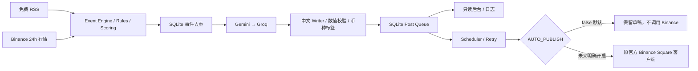

# Binance Square AI — Phase 1

[English](README.md) | **简体中文**

基于 [MIT buffer-poster-bot](https://github.com/SMOService/buffer-poster-bot) 的增量改造。
只采用该仓库，不整合其他旧项目。上游版本为 `acc720e9aae7748a029400202626eab26dc8c005`。
原 MIT 许可证和 SMOService 版权声明完整保留，见 [LICENSE](LICENSE)。

**默认只生成草稿：`AUTO_PUBLISH=false`。Docker Compose 强制该值为 false。**
没有部署生产环境，没有使用真实密钥或向 Binance 发布帖子。

## 审计结论

保留 SQLite、Post Queue、Scheduler、指数退避、去重、发布日志、Docker，以及原 Binance Square 官方发布客户端。
默认入口和容器不再依赖 Telegram、Buffer、imgbb、catbox 或 0x0.st。
旧业务源码暂时保留；`bot.py` 被禁用，避免误运行旧发布流程。运行时不安装 aiogram。

完整文件职责、保留/删除/重构清单、风险与修复见 [Phase 1 审计](docs/PHASE1_AUDIT.md)。
来源与官方 API 参考见 [UPSTREAM](docs/UPSTREAM.md)；历史说明保留在 `docs/UPSTREAM_README.md`。

## 新架构

```text
src/
  collectors/
    binance_market/        Binance Spot exchangeInfo + 24hr ticker
    crypto_news/           CoinDesk / Cointelegraph / Decrypt / The Block RSS
    binance_futures/        扩展边界，Phase 1 未实现采集
    binance_announcement/   扩展边界，Phase 1 未实现采集
  engine/
    event_engine.py         统一事件、规则过滤、持久化
    scoring.py              可解释的初始评分
    deduplicator.py         新闻标题去重、同币种每小时快照去重
    rules.py                评分阈值、时效和未来时间检查
  ai/
    provider.py             AIProvider 协议、Gemini → Groq fallback
    gemini.py / groq.py      REST 适配器，密钥仅从环境读取
    classifier.py           确定性分类，不额外消耗模型请求
    writer.py               中文评论、长度/开头检查、真实数据追加
  publisher/
    binance_square/         适配原 services/binance.py；本地持久化图片
    retry.py                指数退避、UTC quota reset
  storage.py                事件、原子去重/入队、开头历史、AI 请求预算
  pipeline.py               采集 → 事件 → Writer → SQLite 草稿队列
  scheduler.py              独立发布调度，dry-run 门控
  app.py                    只读后台、API、health、后台任务
  cli.py                    本地手动图文入队 / 单次采集
  http.py / settings.py     公共 timeout/retry 和配置
db.py                       复用上游 DB，增量迁移到 schema v6
services/binance.py          复用官方 v1/v2 text/image 发布流程
prompts/writer.txt           可编辑 Prompt
```



新闻统一返回 `{id, source, title, summary, url, published_at, symbols}`。
HTML 标签被移除、链接移除跟踪参数、发布时间转 UTC。无可靠日期的条目跳过，绝不把时间补成“刚刚”。
单个 RSS 源失败不阻断其他源；失败写入采集日志，不依赖付费新闻服务。

行情返回 `symbol, base_asset, quote_asset, last_price, change_24h, volume_24h, quote_volume_24h,
high_24h, low_24h, timestamp, source`。数值保留十进制字符串，`change_24h` 为百分比，
`volume_24h` 为基础币种数量，`quote_volume_24h` 为报价币种成交额。
币种来自 Binance exchangeInfo 的 baseAsset，避免把交易对当作 `$BTCUSDT` 标签。

事件统一为 `{type, symbol, score, timestamp, data, source}`。
初始评分是可配置阈值配合确定性规则：新闻按摘要/币种信息加分，行情按绝对 24h 变化加分；不是预测模型。
新闻采用规范化标题跨源去重；行情同币种每 UTC 小时最多一个事件。原 MD5 文本去重继续保留。

## 本地启动

需要 Python 3.12+，在本项目根目录执行：

```bash
python -m venv .venv
# Linux / macOS
source .venv/bin/activate
# Windows PowerShell
# .venv\Scripts\Activate.ps1
pip install -r requirements.txt
cp .env.example .env
python -m src.app
```

Windows 可用 `Copy-Item .env.example .env`。应用自动加载项目根目录 `.env`，已有环境变量优先。
无任何 API Key 也能启动、采集和查看事件；只有配置可用模型后才生成 AI 草稿。
优先配置 Gemini，Groq 可选；模型 ID 可更换。**免费额度与可用模型以你的账号为准，项目不假设每月一定有 $10。**

后台：<http://127.0.0.1:8080/>。默认每 15 分钟采集、每 60 秒检查队列。
当前后台只读，可查看完整草稿、事件评分/状态、准备/发布日志；没有发送按钮。
本地无需采集时可设 `COLLECT_ENABLED=false`。

## Docker Compose

需要 Docker Engine 与 Docker Compose v2.24+（支持可选 env_file）。

```bash
cp .env.example .env
# 编辑 .env，API Key 可暂留空
docker compose config --quiet
docker compose up --build -d
docker compose ps
docker compose logs --tail=100
```

Compose 只把 8080 映射到宿主机 `127.0.0.1`，SQLite 和图片放在 `bot-data:/app/data`。
即使 `.env` 中误设 true，Compose 仍强制 `AUTO_PUBLISH=false`。
容器以非 root 用户运行，使用 `/health` healthcheck。不要同时运行多个共享该 DB 的 worker。
此次环境没有 Docker CLI，因此这里只完成静态配置检查和同入口的本地进程实启；容器实启未核验。
CI 已新增 Compose build/up/health smoke 步骤，但未声称远程 CI 已执行。

若以后通过域名反代访问，先设置随机 `ADMIN_TOKEN`，保留 loopback 端口映射，并在反向代理配置 TLS。
浏览器使用 Basic 登录：用户名 `admin`，密码为该 token；API 支持 `Authorization: Bearer ...`。
token 不接受 URL query，后台内容做 HTML 转义。独立公开地址监听需要 ADMIN_TOKEN，
`ALLOW_UNAUTHENTICATED_ADMIN=true` 只用于明确隔离的本地访问；Compose 已限制宿主端口。

## 只读 API 与 Health

| 路径 | 返回 |
| --- | --- |
| `GET /health` | DB 可用性、任务状态、dry-run、是否配置模型；故障时 503 |
| `GET /api/queue?limit=100&offset=0` | 草稿及已发布条目、状态、媒体和错误 |
| `GET /api/events` | 结构化事件、生成尝试和状态 |
| `GET /api/logs` | 草稿准备、采集/写作失败、发布日志 |

API 使用 limit/offset 分页，limit 最大 200。health 无需 token；其他路径在配置 token 后受保护。
服务健康不代表外部 RSS/API 都在线；采集详情见 worker result 与采集日志。

## 手动图文入队（不会发送）

```bash
python -m src.cli enqueue --text '这里是需要检查的中文草稿 $BTC'
```

把图片放到 `data/media/`，使用相对该目录的路径：

```bash
python -m src.cli enqueue --text '图文草稿 $ETH' --image chart.png
python -m src.cli enqueue --text '定时草稿 $BTC' --publish-at 2026-10-08T09:00:00+08:00
python -m src.cli collect-once
```

每条最多 4 张图片、单张最多 10 MB；支持 jpg/jpeg/png/gif/webp，禁止路径越过 MEDIA_ROOT。
Compose 中可用 `docker compose exec square-ai python -m src.cli ...`，文件必须在容器持久卷内。
AI Writer 本阶段生成文本，不自动生成或下载配图；手动图文入队和官方图片发布能力保留。
旧 Telegram file_id 或 URL 图床媒体需要人工迁移，绝不会静默降级为文本。

## Writer 与安全门

- 模型仅生成 JSON 中的中文 opening/commentary；Prompt 可修改，核心数据约束不可由风格 Prompt 取消。
- 数值、行情字段、来源时间由代码从事件原始数据追加；模型输出含数字、行情数量断言、虚构标签会拒绝。
- 新闻保留原始标题和原文链接，明确注明来源及待核验；不从新闻推导实时价格。
- 自动追加正确 `$BTC`、`$ETH` 等标签；未知或没有币种的新闻不硬贴 BTC。
- 最近 30 条开头保存在 SQLite，相似或固定模板开头重新生成，最多 2 次；不合格则暂不入队。
- `WRITER_MAX_CHARS` 控制总字符数，含来源、行情、标签；无法容纳真实字段时拒绝生成，不截断关键数据。
- 自由评论仍应人工审阅，Phase 1 不声称完成全面的语义事实核查。

`AUTO_PUBLISH=false` 在 scheduler、publisher 和底层 Binance 客户端都有检查。
不 claim、不上传图片、不发送 content/add，不把草稿假记为 published。
所有模型/采集外部请求都有 timeout 和有界重试，重试采用指数退避并处理 Retry-After。
模型请求、密钥或原始响应不会写入应用日志；日志及 DB 错误字段对已配置密钥和签名 query 脱敏。

发布流程继续遵循官方 v2 presignedUrl → PUT → imageStatus → v1 content/add。
部分图片上传失败时保留全部媒体并退避；permanent / 重试耗尽进入 dead；auth 暂停一小时，quota 等到 UTC 午夜。
非幂等 content/add 不在 HTTP 层盲目重发：明确失败由持久队列处理，网络超时/中断或无法确认结果进入 `review`。
`review` 不会自动发送，需要未来人工核对 Binance 端结果；HTTP 504 保留官方成功但无 post ID 的约定。
发布中崩溃恢复也进入 review，避免一启动就重复发帖。

## 配置

完整选项见 [.env.example](.env.example)。

| 配置 | 默认 / 含义 |
| --- | --- |
| `GEMINI_API_KEY`, `GEMINI_MODEL` | 空 Key；主模型 gemini-flash-latest |
| `GROQ_API_KEY`, `GROQ_MODEL` | 空 Key；备用 llama-3.3-70b-versatile |
| `BINANCE_SQUARE_API_KEY` | 空，dry-run 不需要 |
| `AUTO_PUBLISH` | false；Compose 固定 false |
| `DATABASE_URL` | sqlite:///data/bot.db；仅文件 SQLite；旧 DB_PATH 为兼容 fallback |
| `WRITER_PROMPT_PATH`, `WRITER_MAX_CHARS` | prompts/writer.txt；650，支持 180–2000 |
| `MARKET_SYMBOLS` | BTCUSDT,ETHUSDT，最多 20 个合法交易对 |
| `EVENT_MIN_SCORE`, `EVENT_MAX_AGE_SEC` | 40；86400 |
| `MAX_DRAFTS_PER_CYCLE`, `MAX_DRAFTS_PER_DAY` | 3；10，按 UTC 日 |
| `MAX_AI_REQUESTS_PER_DAY` | 40，所有模型 HTTP 请求（含 retry/fallback）共享持久预算 |
| `EVENT_MAX_ATTEMPTS` | 3，生成失败按 5min×2 退避 |
| `HTTP_TIMEOUT_SEC`, `HTTP_MAX_ATTEMPTS` | 30s；3 次；Binance 媒体操作使用原有独立 timeout |
| `BINANCE_MAX_ATTEMPTS` | 6，发布队列；退避 300s 到 21600s |

AI 预算限制请求次数而非金额；不同模型、token 长度、账号额度会影响实际费用，达到预算后停止新模型网络请求。
额度和尝试数持久化，重启不会重置。升级既有 DB 前请备份；迁移新增字段/表，不删除原数据和旧频道表。

## 验证

```bash
pip install -r requirements-dev.txt
python -m pytest -q
ruff check .
python -m compileall -q src config.py db.py services/binance.py
```

测试使用临时 SQLite、fixture 模型和本地 mock HTTP 服务，不需要真实密钥、不会向 Binance 发布。
覆盖迁移、claim 并发、去重事务、预算、fallback、RSS、行情、Writer、dry-run、完整官方图文请求协议、
图片失败保留、指数退避、quota/auth、dead/review、后台/health/鉴权和管道重启。
本次实际测试结果与限制见 [验证记录](docs/VALIDATION.md)。

Phase 1 不包含 Futures/公告采集实现、自动配图、生产部署、完整运营后台、真实模型或 Binance 账号联调。
